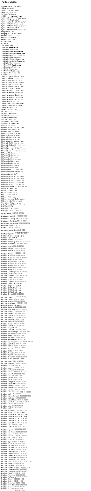

# Additional fonts inside the PlantUML docker container

It is possible to make additional fonts available to PlantUML by mapping them via a volume within the docker container.

Since the base image from the docker container is using Ubuntu, fonts can easily be provided by just adding them somewhere inside the `~/.local/share/fonts` directory.

**Tipp**: to not overwrite the container fonts add the additional files inside an own sub-folder, e.g., `custom` or `host`.

In the following you can find an example how to provide all fonts of your host machine in the PlantUML docker container for Jetty and Tomcat.


## Jetty

In the case of the Jetty docker container the home directory is `/var/lib/jetty`.

```yaml
services:
  plantuml-server:
    image: plantuml/plantuml-server:jetty
    container_name: plantuml-server
    ports:
      - "80:8080"
    environment:
      - TZ=Europe/Berlin
      - BASE_URL=plantuml
    volumes:
      - /usr/share/fonts:/var/lib/jetty/.local/share/fonts/host:ro
```


## Tomcat

In the case of the Tomcat docker container the home directory is `/root`.  
_Yes, the tomcat container is running as `root` which is basically a really bad idea w.r.t. security. Create a pull request and maintain it if you want to change that._

```yaml
services:
  plantuml-server:
    image: plantuml/plantuml-server:tomcat
    container_name: plantuml-server
    ports:
      - "80:8080"
    environment:
      - TZ=Europe/Berlin
      - BASE_URL=plantuml
    volumes:
      - /usr/share/fonts:/root/.local/share/fonts/host:ro
```


## Verification

The following command will print a list of all available fonts inside the docker container:

```bash
docker exec -it plantuml-server fc-list
```

To find a special font add a grep filter to the command:

```bash
docker exec -it plantuml-server fc-list | grep "<name-of-font>"
```

Naturally, it is also possible to check this via PlantUML itself by rendering the following diagram:



**Note**: If you have added a lot of fonts: (a) this diagram may take a few seconds to generate, and (b) eventually the PNG image may be clipped. To avoid the latter, render the diagram as an SVG image.
